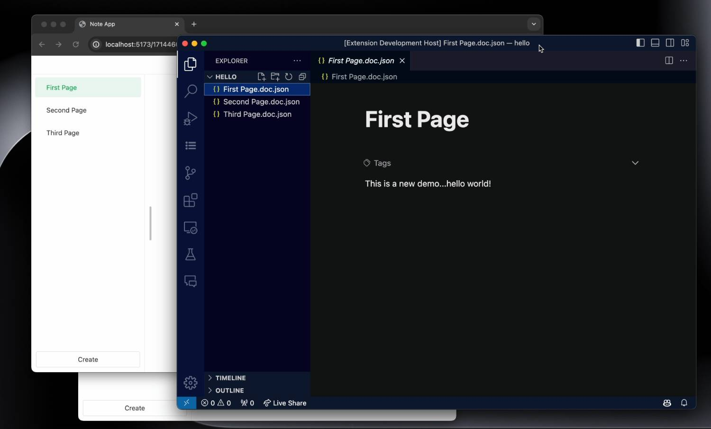
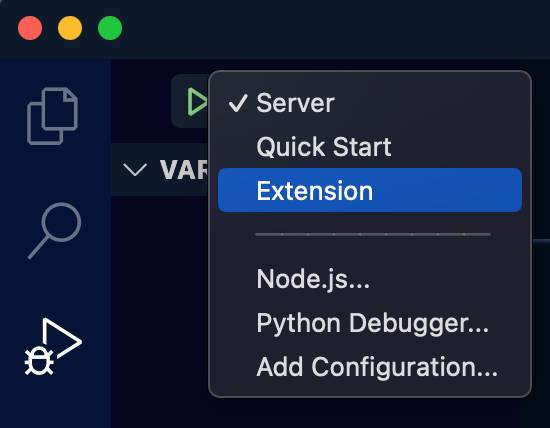

# NoteSuite

Experimental note-taking app based on [BlockSuite](https://github.com/toeverything/blocksuite) and [ystream](https://github.com/yjs/ystream).



## Overview

* Isomorphic client and web builds.
* Mapping workspace into files hosted on WebDAV.
* VSCode extension for file editing.
* Documents persisted as `Y.Doc` in ystream instance.

## Development

Install deps:

```sh
pnpm i
```

Start server and client:

```sh
pnpm dev:server
pnpm dev:client
```

The VSCode extension can be started in VSCode:




Run E2E tests (make sure to run `npx playwright install` before):

```sh
pnpm test
```
